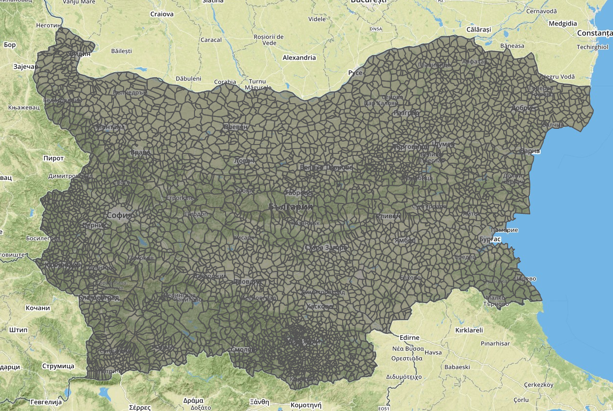
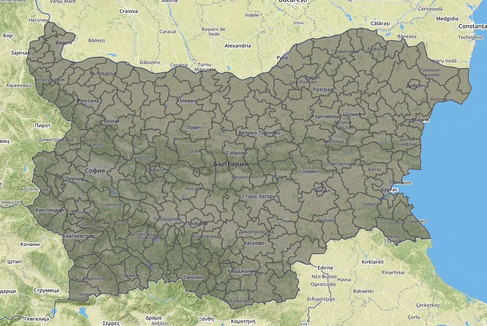
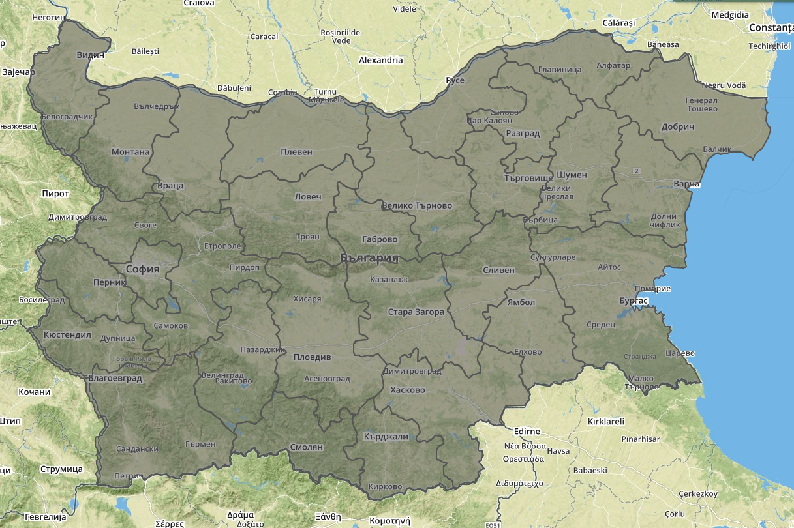

Geocoding resources for Bulgaria
==================

This is a collection of resources that should help anyone working with geocoding or mapping data in Bulgaria.

municipalities.csv
------------------
A list with all municipalities
- EKATTE - Bulgarian region coding system
- code - classification by the Statistics office
- name - in Bulgarian

settlements.geojson
------------------

This is a simplified version of the territorial separation of Bulgaria among the grounds of settlements. While some settlements don't have assigned grounds, they reside inside the grounds of other settlements. In such cases they would be listed in the "contains" array property.
The shapes do not reflect accurately the actual grounds or their overall size. They do match them within reasonable margin of error, which would be enough for most visualization purposes. More accurate maps can be obtained from the national Cadastre office.
For more information, check http://yurukov.net/blog/2015/03/16/zemlishta/ (in Bulgarian)
- ekatte - Bulgarian region coding system
- nuts4 - municipality code
- nuts3 - province code
- contains - a list of ekatte codes of settlements that may reside inside this area

Examples:
- population distribution in Bulgaria Dec. 2013 https://gist.github.com/yurukov/c4f9ba37b311b53088f1
- logging permits in Bulgaria Apr. 2011 - Dec. 2014 https://gist.github.com/yurukov/136e144bbd634406054e

settlements.csv
------------------
List with all cities, towns and villages in Bulgaria with size of the grounds of the settlement as well as population as of Dec 2013. For some entities the size of the grounds is missing, which means that it is unknown. For others, it's 0, which means that the settlements does not have it's own grounds, but resides in the grounds of another settlement. The population of many settlements is 0. Some of the names in English are also missing.
- ekatte - Bulgarian region coding system
- municipality code - classification by the Statistics office
- name_bg - name in Bulgarian
- name_en - name in English
- area - size of the grounds
- population - esimates of the Statistics office for Dec 2013

settlements_loc.csv
------------------
Similar to settlements.csv, but lists the names of the municipality and provice, as well as geocoordinates of most settlements. For at least 300 the coordinates are missing.
- EKATTE - Bulgarian region coding system
- municipality code - classification by the Statistics office
- municipality - name of the municipality
- province - name of the province
- village - 0=city,town 1=village
- name - in Bulgarian
- postal code - postal code of the settlement
- geo - coordinages extracted from openstreetmap. Those missing are marked as "n/a"

municipalities.geojson
------------------

Borders of each municipality
- nuts3 - province code
- nuts4 - municipality code

provinces.geojson
------------------

Borders of each province
- nuts3 - province code

rpu_sofia.geojson
------------------

Borders of the regions of each police station in the capital Sofia. Multipolygons mark only populated places for each reagion. Simple lines encircle the whole territory.
- name - name of the police station in Bulgarian
- description - explains the region with bordering streets and neighborhoods plus contact data. In Bulgarian
- url - website of the station
- id - unique id in ascii
- address - address of the station itself
- telephone - contacts
- populationEst - estimated population of the covered area

res_plants.tsv
------------------
Locations of all RES power plants connected to the grid until Dec 2013. In Bulgarian.
- code - identification by the Ministry of economy and energy
- type - type of power plant
- firma - company owning the plant
- bulstat - company identification
- fobshtina - municipality where the owner is registered
- fgrad - city/village where the owner is registered
- vei - name of the RES plant
- vobshtina - municipality where the owner is located
- vgrad - city/village where the owner is located
- moshtnost - potential power output
- vavejdane - date when the plant was built in format ddmmyy
- geo - 2/3 of the coordinates are precise and taked from the RES association. The rest are set close the the city/village marked in Ministry reports

NSI/Ekatte
------------------
Original documentation and reference tables for the Ekatte coding system by the National statistics institute
